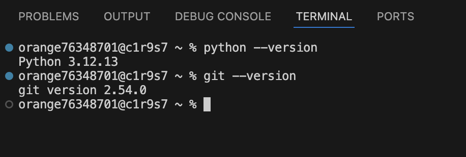
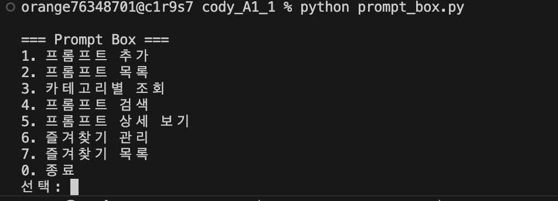
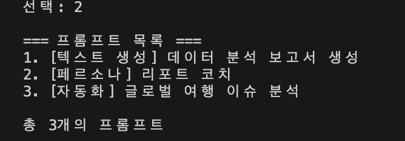
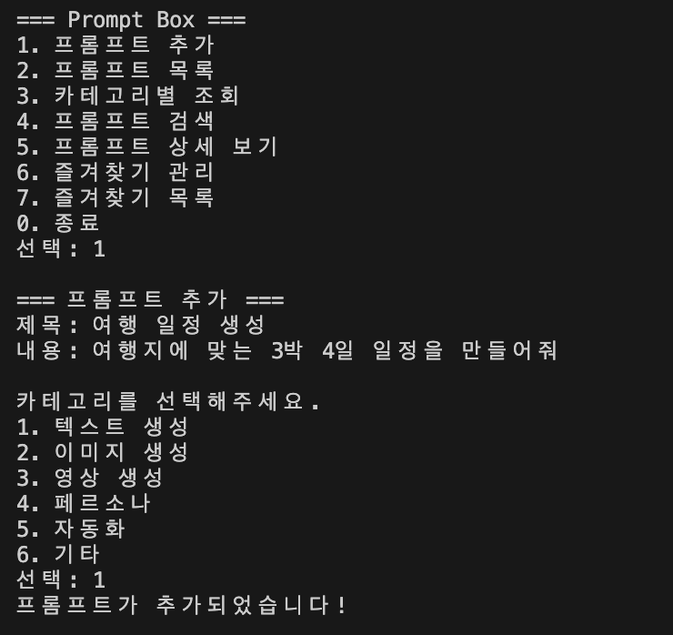
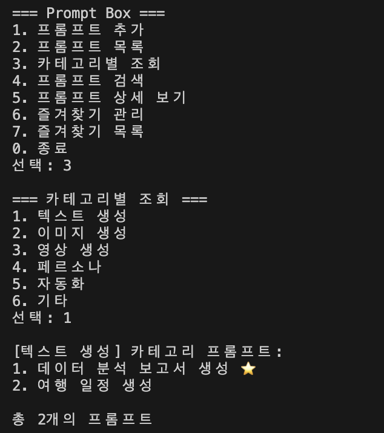
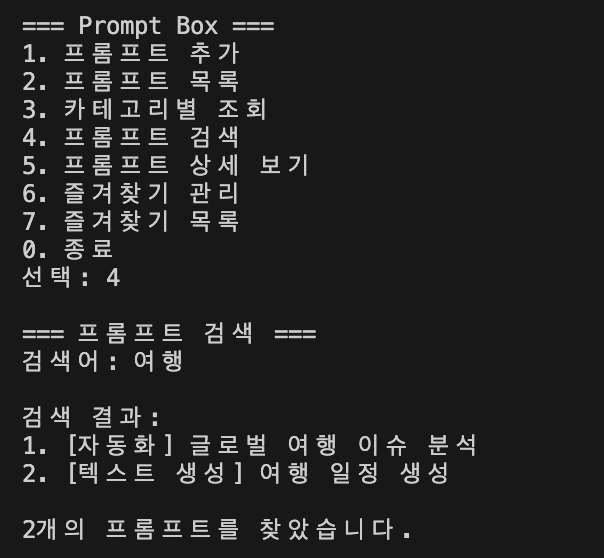
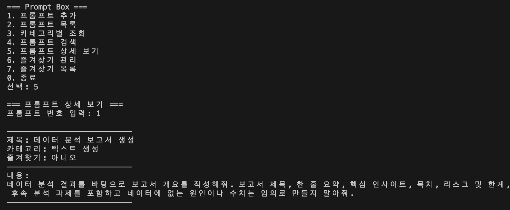
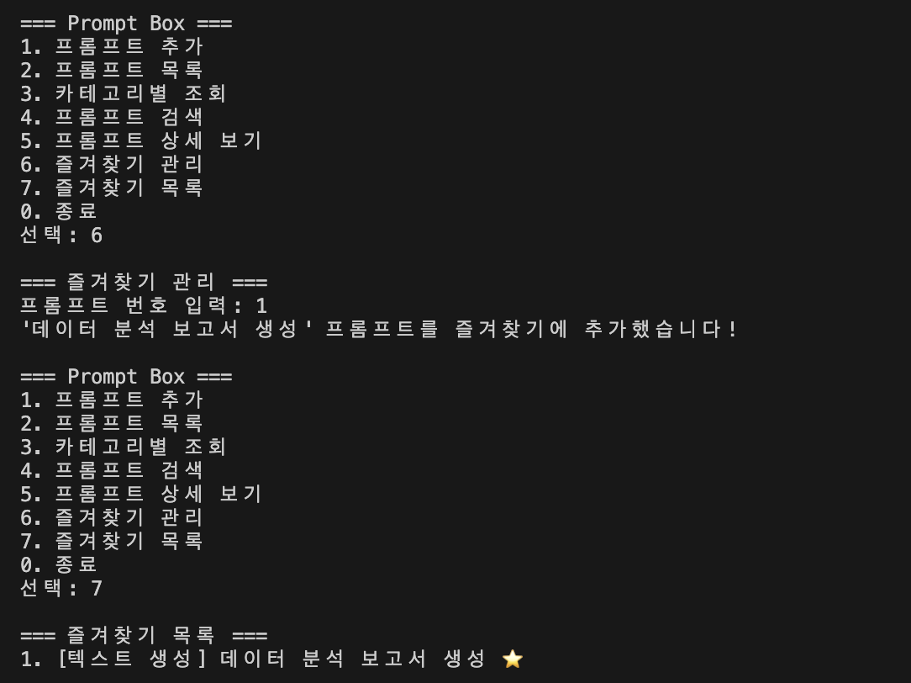
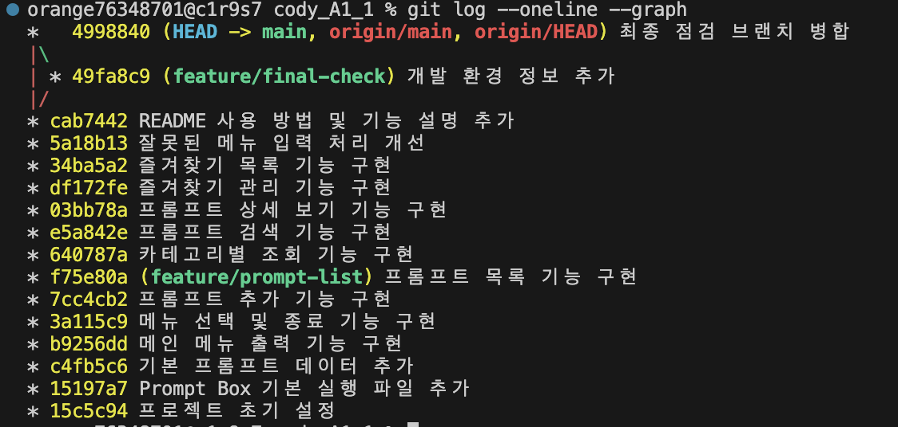

# Prompt Box

Python과 Git 기초 학습을 위해 만든 콘솔 기반 프롬프트 관리 프로그램입니다.

자주 사용하는 AI 프롬프트를 등록하고 카테고리별로 관리할 수 있으며,
검색, 상세 보기, 즐겨찾기 등의 기능을 사용할 수 있습니다.

## 실행 방법

Python 3.10 이상이 필요합니다.

터미널에서 프로젝트 폴더로 이동한 후 다음 명령어를 실행합니다.

```bash
python prompt_box.py
```

## 주요 기능

1. 프롬프트 추가
   - 제목과 내용을 입력하여 새로운 프롬프트를 추가할 수 있습니다.
   - 제목 또는 내용을 입력하지 않으면 다시 입력하도록 안내합니다.
   - 기본 카테고리 또는 직접 입력한 카테고리를 사용할 수 있습니다.

2. 프롬프트 목록
   - 등록된 모든 프롬프트의 제목과 카테고리를 확인할 수 있습니다.
   - 즐겨찾기된 프롬프트에는 ⭐가 표시됩니다.

3. 카테고리별 조회
   - 원하는 카테고리의 프롬프트만 확인할 수 있습니다.

4. 프롬프트 검색
   - 제목과 내용에 포함된 키워드로 프롬프트를 검색할 수 있습니다.

5. 프롬프트 상세 보기
   - 프롬프트 번호를 입력하여 제목, 카테고리, 즐겨찾기 여부, 전체 내용을 확인할 수 있습니다.

6. 즐겨찾기 관리
   - 원하는 프롬프트를 즐겨찾기에 추가하거나 해제할 수 있습니다.

7. 즐겨찾기 목록
   - 즐겨찾기로 등록된 프롬프트만 모아서 확인할 수 있습니다.

8. 잘못된 입력 처리
   - 존재하지 않는 메뉴나 프롬프트 번호를 입력하면 안내 메시지를 출력합니다.

## 카테고리

- 텍스트 생성
- 이미지 생성
- 영상 생성
- 페르소나
- 자동화
- 기타

## 기본 프롬프트

프로그램에는 이전 AI 학습 미션에서 활용한 내용을 바탕으로 3개의 기본 프롬프트가 등록되어 있습니다.

- 데이터 분석 보고서 생성
- 리포트 코치
- 글로벌 여행 이슈 분석

## 데이터 저장 방식

프롬프트 데이터는 프로그램 실행 중 리스트와 딕셔너리를 이용하여 관리합니다.

프로그램을 종료하면 실행 중 추가하거나 변경한 데이터는 초기화됩니다.

## 개발 환경

- Python 3.12

## 실행 결과

### 개발 환경 설정



### 메인 메뉴



### 기본 프롬프트 목록



### 프롬프트 추가



### 카테고리별 조회



### 프롬프트 검색



### 프롬프트 상세 보기



### 즐겨찾기 관리



## Git 작업 기록

기능별로 커밋을 작성하고 별도 브랜치에서 기능을 개발한 뒤 main 브랜치에 병합했습니다.



## 주요 함수 설명

Prompt Box는 기능별로 함수를 분리하여 구성했습니다.

| 함수명 | 역할 | 사용 목적 |
|---|---|---|
| `show_menu()` | 메인 메뉴를 출력 | 사용자가 원하는 기능을 번호로 선택할 수 있도록 안내 |
| `add_prompt()` | 새로운 프롬프트 추가 | 제목, 내용, 카테고리를 입력받아 `prompts` 리스트에 저장 |
| `show_list()` | 전체 프롬프트 목록 출력 | 등록된 프롬프트의 번호, 카테고리, 제목, 즐겨찾기 여부를 한눈에 확인 |
| `show_by_category()` | 카테고리별 프롬프트 조회 | 선택한 카테고리에 해당하는 프롬프트만 필터링하여 출력 |
| `search_prompt()` | 키워드로 프롬프트 검색 | 제목 또는 내용에 검색어가 포함된 프롬프트를 찾아 출력 |
| `show_detail()` | 특정 프롬프트 상세 정보 출력 | 번호를 입력받아 제목, 카테고리, 즐겨찾기 여부, 전체 내용을 확인 |
| `toggle_favorite()` | 즐겨찾기 추가 및 해제 | 선택한 프롬프트의 `favorite` 값을 `True` 또는 `False`로 변경 |
| `show_favorites()` | 즐겨찾기 목록 출력 | `favorite` 값이 `True`인 프롬프트만 모아서 출력 |

### 함수 분리 목적

모든 코드를 한 곳에 작성하지 않고 기능별로 함수를 분리했습니다.

이렇게 구성하면 각 기능의 역할이 명확해지고,
특정 기능을 수정하거나 오류를 확인할 때 해당 함수만 확인할 수 있어
코드의 가독성과 유지보수성이 좋아집니다.

## 주요 Python 문법 활용

| 문법 | 사용 목적 |
|---|---|
| `list` | 여러 프롬프트 데이터를 순서대로 저장 |
| `dict` | 각 프롬프트의 제목, 내용, 카테고리, 즐겨찾기 정보를 하나의 데이터로 관리 |
| `if / elif / else` | 메뉴 선택 및 입력값에 따라 다른 기능 실행 |
| `for` | 프롬프트 목록을 반복해서 조회하고 출력 |
| `while` | 프로그램 종료 전까지 메뉴를 반복 출력하고 빈 입력을 다시 요청 |
| `input()` | 사용자에게 메뉴 번호, 제목, 내용, 검색어 등을 입력받음 |
| `print()` | 메뉴와 실행 결과를 터미널에 출력 |
| `True / False` | 즐겨찾기 상태를 저장 |